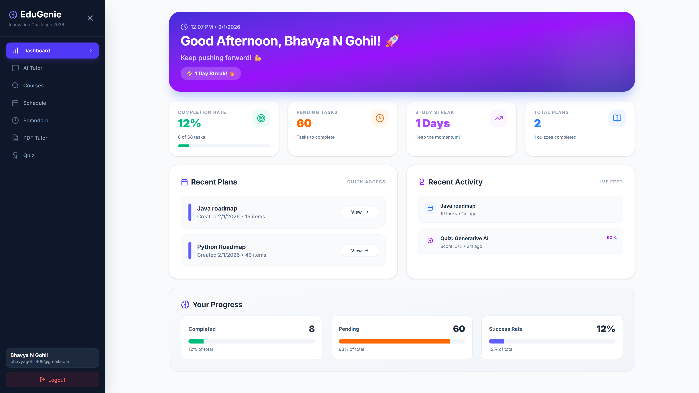
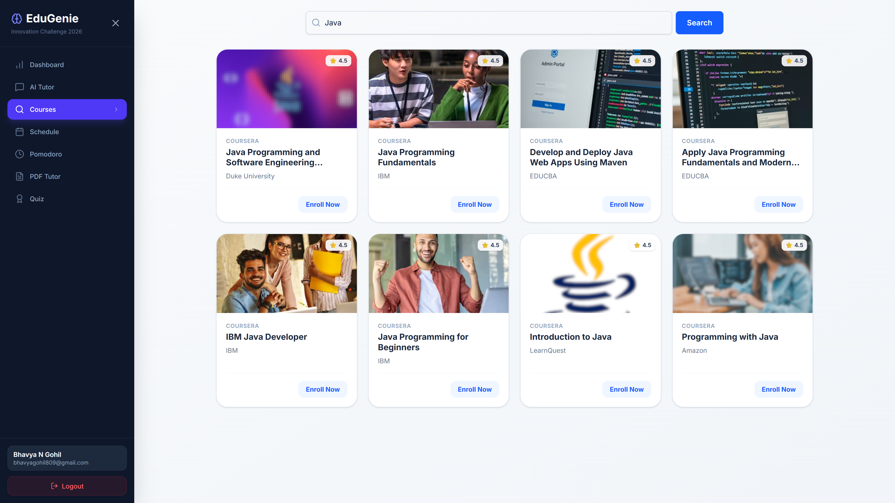
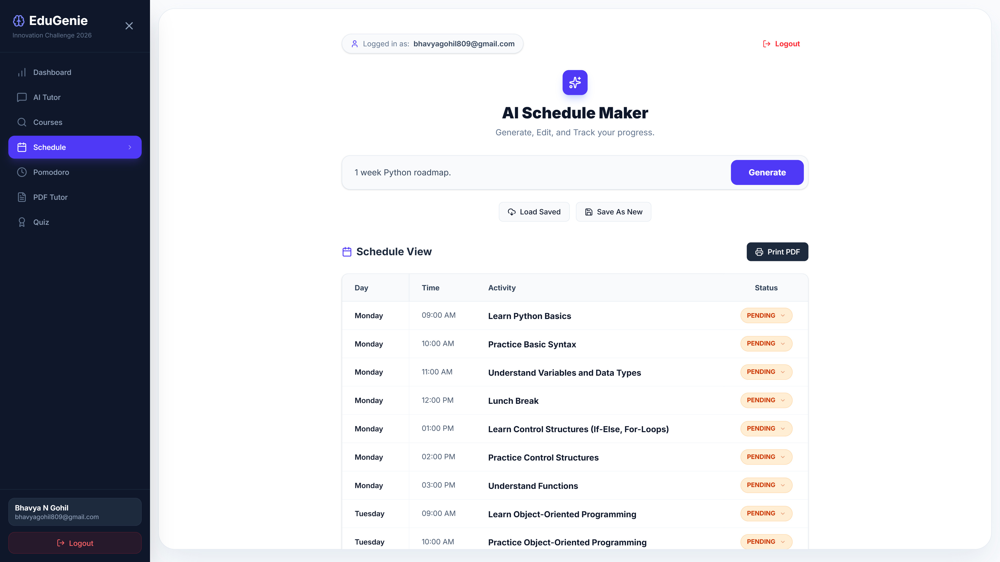
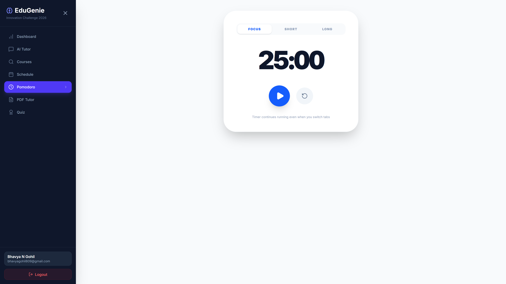
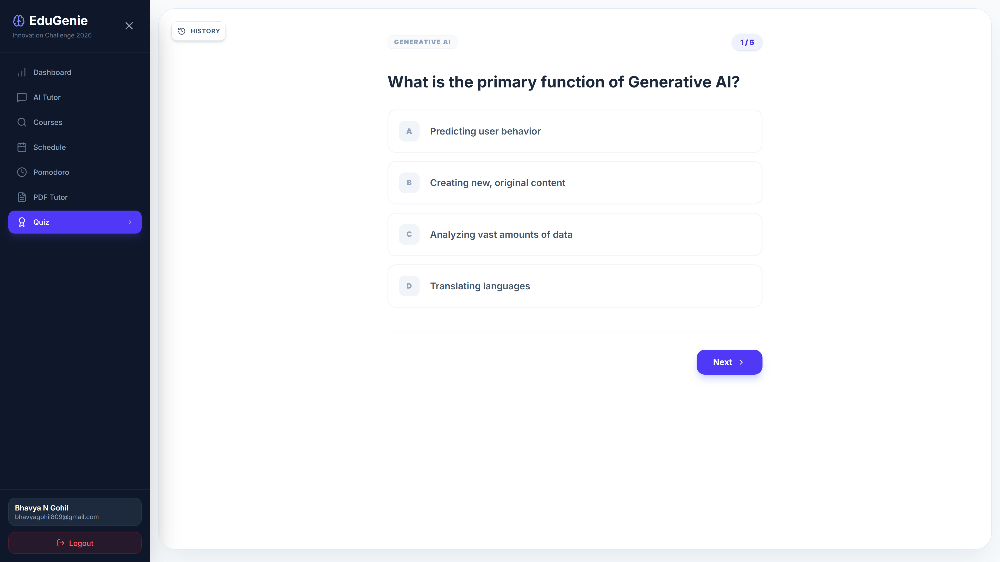
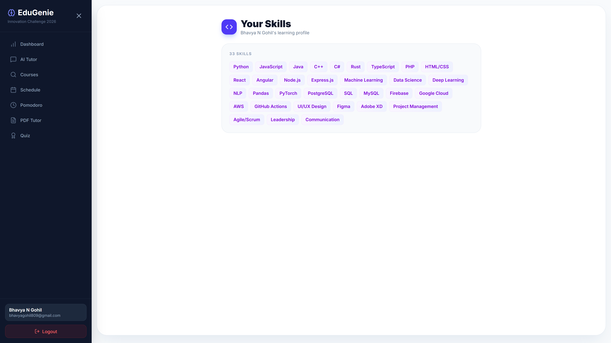

# EduGenie — AI Learning Platform (Hackathon Overview)

## 1) What this project is
EduGenie is a Next.js (App Router) web app that personalizes learning with AI. It combines:
- **AI chat tutoring** (general + PDF-based)
- **Automated quiz generation**
- **Automated study schedule generation**
- **Course discovery with caching**
- **Skills-based onboarding** for personalization

This project was built for the **AI Innovation Hackathon 2026** and aligns with the provided Program Details PDF.

## 2) Live demo (no install needed)
If you want to see the site without downloading, open:
**https://ai-tutor-frontend-2jv7.onrender.com**

> Note: The live demo runs on a free tier, so initial load and API responses can be slower.

## 3) Key features (judge-friendly summary)
1. **AI Tutor & Chat** — interactive, multi-topic tutoring flow with conversational UI.
2. **PDF Tutor** — upload PDFs, extract text, and chat with content (document-grounded help).
3. **Quiz Generator** — auto-generates quizzes from prompts or selected content.
4. **Schedule Generator** — auto-creates study schedules from a user prompt.
5. **Course Discovery** — fetches courses and caches results for faster repeat queries.
6. **Skills Onboarding** — collects user skills to personalize experience.

## 4) Automation functionality (what’s automated)
- **Auto-schedule creation**: API builds a structured schedule from user input.
- **Auto-quiz creation**: API generates quizzes on demand.
- **Auto-course discovery**: Fetches & caches results to reduce repeated network calls.
- **Auto-PDF extraction**: Parses uploaded PDFs and makes them chat-ready.

## 5) Tech stack
- **Frontend**: Next.js 16 (App Router), React, Tailwind CSS
- **Backend (serverless)**: Next.js API routes
- **Database/Auth**: Supabase
- **AI Providers**: Groq, Generative AI (as configured)
- **Optional external service**: Course fetcher Express server

## 6) Project structure (high-level)
- Frontend pages: [app](app)
- Signup flow: [app/signup/page.tsx](app/signup/page.tsx)
- Login flow: [app/login/page.tsx](app/login/page.tsx)
- Dashboard content: [app/components/DashboardContent.tsx](app/components/DashboardContent.tsx)
- PDF tutor: [app/components/pdf_tutorContent.tsx](app/components/pdf_tutorContent.tsx)
- Course search UI: [app/components/CourseContent.tsx](app/components/CourseContent.tsx)
- API routes: [app/api](app/api)
- Supabase client: [lib/supabaseClient.ts](lib/supabaseClient.ts)
- Course fetcher service: [course-fetcher](course-fetcher)

## 7) API routes (what they do)
- [app/api/chat-pdf/route.ts](app/api/chat-pdf/route.ts): PDF Q&A
- [app/api/generate/route.ts](app/api/generate/route.ts): AI generation
- [app/api/generate-quiz/route.ts](app/api/generate-quiz/route.ts): quiz generation
- [app/api/generate-schedule/route.ts](app/api/generate-schedule/route.ts): schedule generation
- [app/api/search-courses/route.ts](app/api/search-courses/route.ts): Udemy API course search + caching
- [app/api/proxy-courses/route.ts](app/api/proxy-courses/route.ts): proxy to course-fetcher backend

## 8) Database overview (Supabase)
- Profiles table stores skills and user profile data.
- Courses table caches course search results.
- Schedules table stores generated schedules.
- PDFs table stores uploaded PDFs and extracted content.

See setup guides:
- [COURSE_SETUP_GUIDE.md](COURSE_SETUP_GUIDE.md)
- [ONBOARDING_README.md](ONBOARDING_README.md)

## 9) Judge guide — run locally (step-by-step)
> Works on Windows, macOS, Linux

### Prerequisites
- Node.js 18+ (recommended 20+)
- npm / pnpm / yarn
- A Supabase project (URL + anon key)

### A) Clone and install
```bash
git clone <your-repo-url>
cd ai_tutor
npm install
```

### B) Environment variables
Create `.env.local` in the project root:
```
NEXT_PUBLIC_SUPABASE_URL=<your-supabase-url>
NEXT_PUBLIC_SUPABASE_ANON_KEY=<your-supabase-anon-key>
SUPABASE_SERVICE_ROLE_KEY=<your-supabase-service-key>
GROQ_API_KEY=<your-groq-key>
GENERATIVE_API_KEY=<your-generative-key>
COURSE_FETCHER_URL=http://localhost:4000
NEXT_PUBLIC_APP_URL=http://localhost:3000
```
or refer to `.env.example` in root folder.

### C) Run the web app
```bash
npm run dev
```
Open http://localhost:3000

### D) (Optional) Run the course fetcher service
```bash
cd course-fetcher
npm install
npm run dev
```
This powers the proxy endpoint used by course search.

## 10) Screenshots (add manually)
- **Landing / Dashboard**: 
- **Ai Tutor**: 
- **Course finder**: 
- **Schedule Generator**: 
- **Pomodoro**: 
- **PDF Tutor**: 
- **Quiz Generator**: 
- **Skill Page**: 

## 11) Why this could win
- **End-to-end learning loop**: onboarding → content → practice → schedule
- **Real automation**: AI-generated schedules and quizzes in seconds
- **Doc-grounded tutoring**: PDFs become interactive learning companions
- **Production-ready architecture**: App Router + Supabase + API routes
- **Scalable & extensible**: easy to add more AI workflows and datasets

## 12) Gitignore notes
The project ignores build outputs and secrets. See [./.gitignore](.gitignore) for:
- `.env*` (environment secrets)
- `node_modules`, `.next`, build artifacts

---

If you’re a judge, you can either:
- **Use the live demo** (link in section 2), or
- **Clone and run locally** (section 9).
